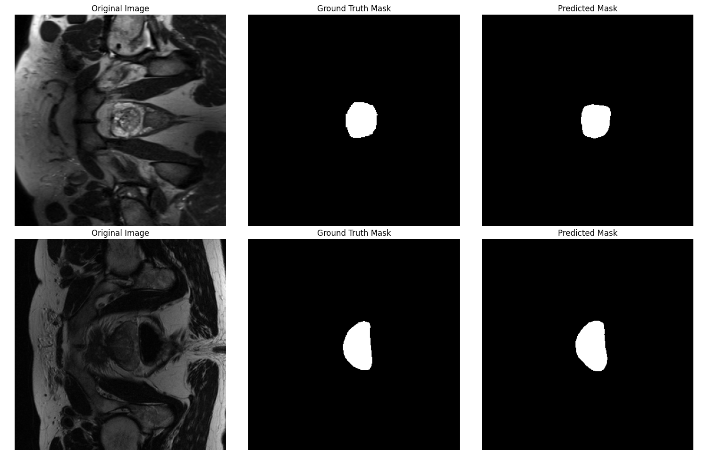

# Prostate Segmentation using U-Net

This project implements a U-Net model for the segmentation of prostate images. It is designed to demonstrate the effectiveness of U-Net architectures for medical image analysis tasks, particularly in segmenting complex structures from varied backgrounds.

## Dataset

The dataset used in this project is sourced from the [SAML Dataset](https://liuquande.github.io/SAML/), which contains a large collection of annotated medical images for semantic segmentation. These images are specifically tailored for machine learning models to learn the segmentation of anatomical structures in medical scans.

## U-Net Model

The U-Net model is a convolutional neural network originally designed for biomedical image segmentation. The architecture is structured as a U-shaped network to efficiently learn from a small number of images while achieving precise localizations. Its design includes a contracting path to capture context and an expansive path that enables precise localization, making it highly effective for tasks like medical image segmentation.

## Results

Here is a visualization of the model's segmentation output compared to the ground truth:



## Dataset Links

- **Main Dataset:** [SAML Dataset Link](https://drive.google.com/file/d/1TtrjnlnJ1yqr5m4LUGMelKTQXtvZaru-/view?usp=sharing)
- **Processed Dataset:** [Processed Dataset](https://drive.google.com/file/d/16Xrat8Sop6E0B6eK4TMTAz4Wu6VaAPPD/view?usp=sharing)

## Project Structure

- `main.py`: The primary script for training the U-Net model. It integrates the model setup, training loop, and saving the trained model.
- `model.py`: Contains the implementation of the U-Net model architecture.
- `dataloader.py`: Defines the PyTorch `Dataset` and `DataLoader` for handling the loading and preprocessing of image data.
- `pre_process.ipynb`: A Jupyter notebook used for the initial preprocessing of the dataset.

## How to Run

To run the training script, simply execute the following command:

```bash
python main.py
```

## Requirements

- torch==2.0.1
- torchvision==0.15.2
- numpy==1.22.0
- matplotlib==3.7.1